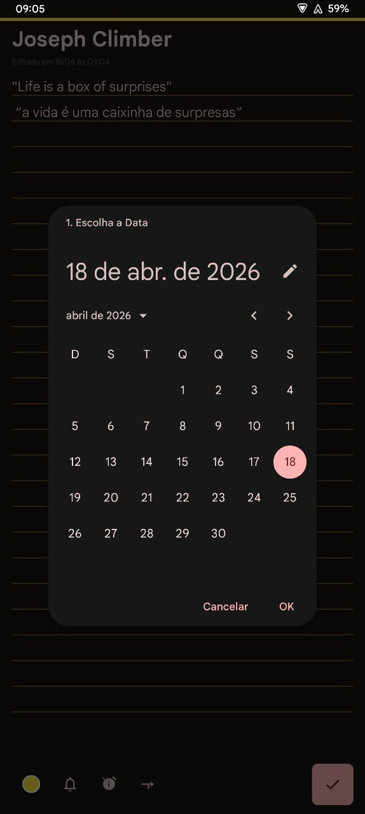
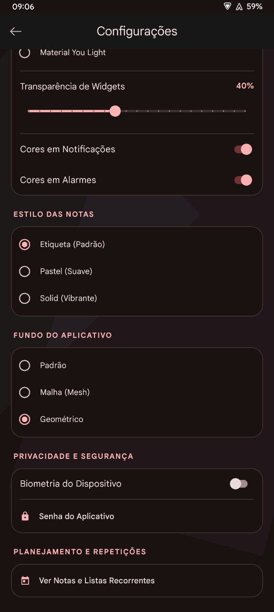
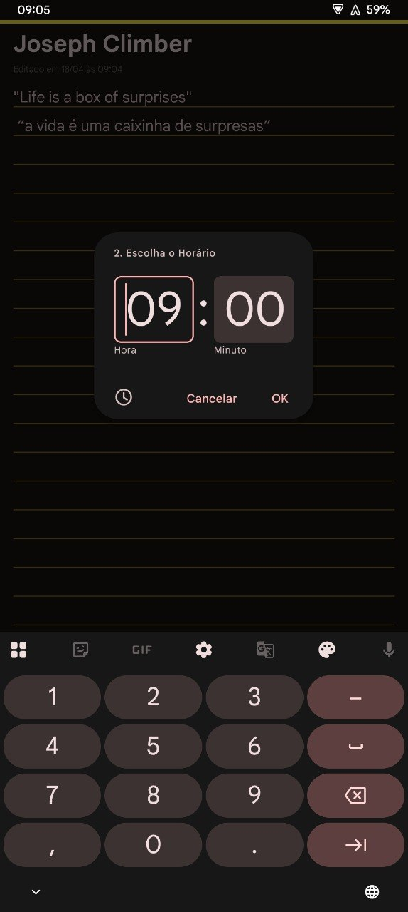
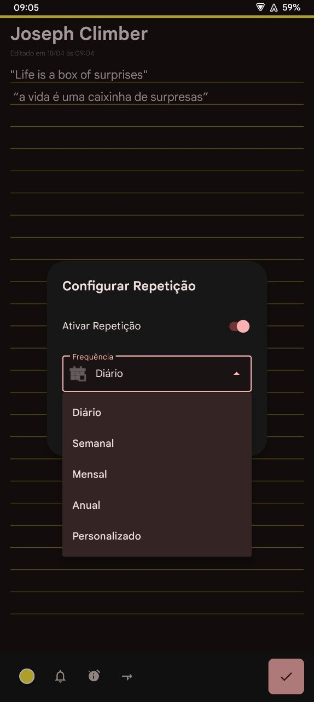
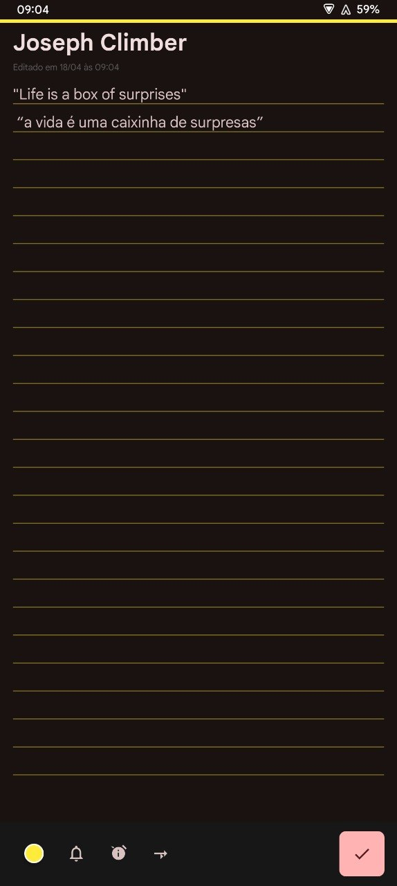
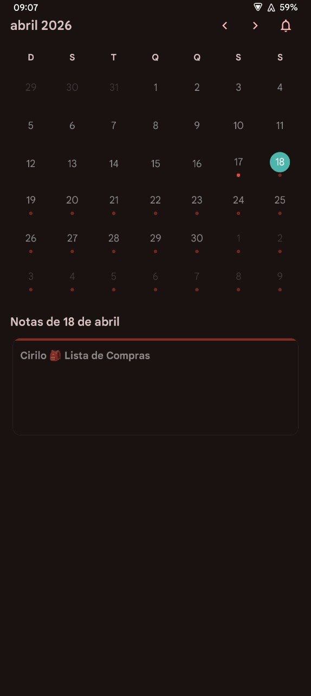
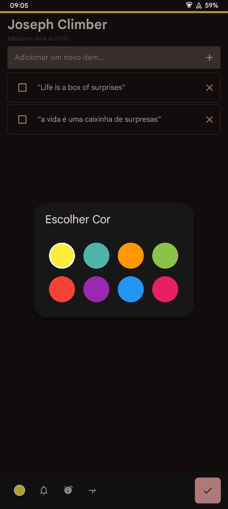
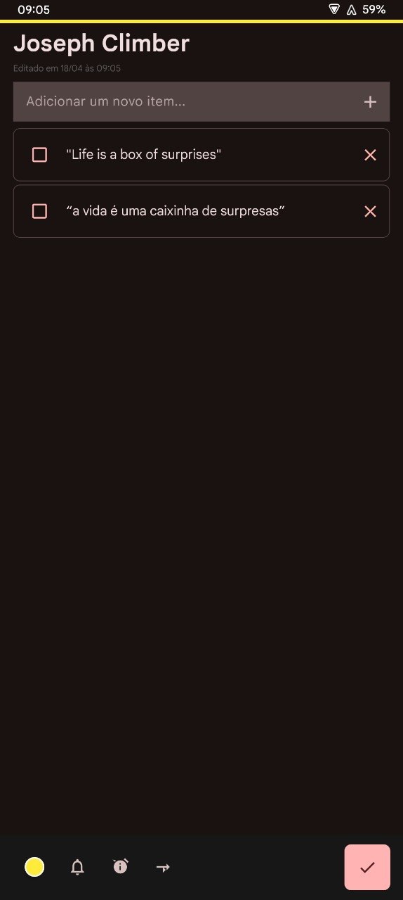

# 📝 Notara

**Notara** é um assistente de produtividade minimalista e ultra-seguro para Android. Projetado para quem busca organização sem abrir mão da privacidade, o Notara combina gerenciamento de tarefas, notas criptografadas e lembretes inteligentes em uma interface moderna e personalizável.

---

## 📸 Galeria

  
  
  
  

  
  
  

---

## ⚡ Principais Funcionalidades

### 🗓️ Gestão Centralizada
*   **Notas e Checklists:** Crie anotações rápidas ou listas de tarefas detalhadas com suporte a cores e categorias.
*   **Calendário Integrado:** Visualize seus compromissos e notas agendadas de forma intuitiva através de uma interface de calendário fluida.
*   **Lixeira Inteligente:** Nunca perca uma ideia. Notas excluídas vão para a lixeira para recuperação futura ou exclusão definitiva.

### 🔒 Segurança e Privacidade (Foco Total)
*   **Criptografia AES-GCM:** Suas notas são protegidas com criptografia de nível militar diretamente no dispositivo.
*   **Proteção Biométrica:** Bloqueie o acesso ao aplicativo ou a notas específicas usando sua impressão digital ou reconhecimento facial.
*   **Armazenamento Local:** Seus dados pertencem a você. Nada é enviado para a nuvem sem o seu consentimento.

### ⏰ Lembretes e Alarmes Avançados
*   **Alarmes com Checklist:** Uma funcionalidade exclusiva onde o alarme exibe sua lista de tarefas imediatamente, garantindo que você comece a agir assim que acordar.
*   **Recorrência Personalizada:** Configure lembretes diários, semanais, mensais ou em dias específicos da semana.

### 🎨 Personalização e Widgets
*   **Temas Dinâmicos:** Suporte ao Material You (Android 12+) e temas exclusivos como o *OLED Pantera Black*.
*   **Widgets de Tela Inicial:** Tenha suas notas e checklists sempre à vista com widgets de diversos tamanhos e estilos.
*   **Fundos Estilizados:** Escolha entre padrões Geométricos, Mesh ou linhas de caderno clássicas.

---

## 🚀 Performance
O Notara é otimizado para ser extremamente leve e rápido, ocupando o mínimo de espaço possível e garantindo compatibilidade total com o **Android 15**.

## 📥 Download
Você pode baixar a versão mais recente do Notara (APKs profissionais divididos por arquitetura) diretamente na aba de **[Releases](https://github.com/lordkaus/Notara_/releases)**.

---
*Desenvolvido com foco em performance, segurança e design.*
